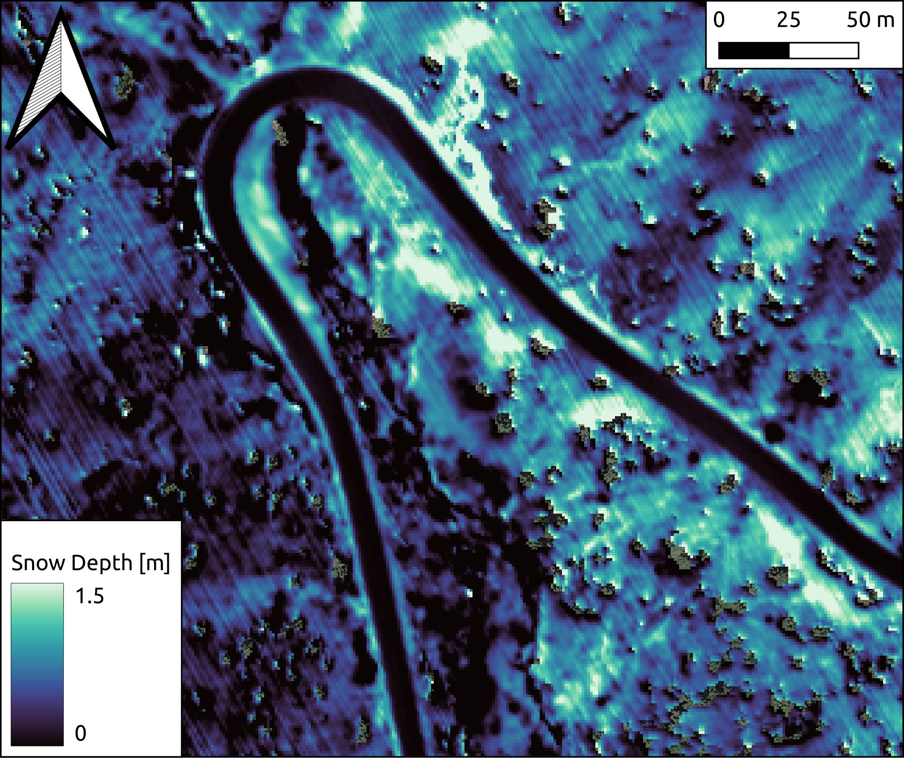

# ice-road-copters :helicopter:


[](https://zenodo.org/badge/latestdoi/505257224)

### Overview
The ice-road-copter suite is designed to post-process point cloud data and enable differencing to resolve change in repeat collections. Our focus is snow depth maps. DEM differencing for snow depths requires detailed knowledge of Coordinate Reference Systems (CRS) for the reference product (snow-free) and other products (snow-on). Alignment issues often persist even when both products are tied to the same CRS, and this needs to be addressed with a co-registration process.  The software relies on the Point Data Abstraction Library (PDAL; www.pdal.io) for point cloud filtering and segmentation.  NASA's Ames Stereo Pipeline  (https://github.com/NeoGeographyToolkit/StereoPipeline) performs the co-registration component of the workflow.  The software is designed to use plowed roadways through the survey domain as co-registration objects, as the snow-covered domain often lacks stable features.   
###  Setting things up! :hammer:
#### Downloading ASP precompiled binaries
1. Download latest stable build (Linux or OSx): https://github.com/NeoGeographyToolkit/StereoPipeline/releases and unzip the folder into the ice-road-copters directory. There are different builds for each OS, but you may have to dig a little to find the OSx build, it gets updated less.
2. Rename this folder as `ASP` and remove the zipped file


#### Setting up Conda environment 

```
$ conda env create -f iceroad_env.yaml
$ conda activate iceroad
```


### Running whole pipeline
from the ice-road-copters directory for example one can run:
```
$ python scripts/ice-road-pipeline.py <path-to-directory-of-laz-files> -e <path-to-user-supplied-reference-dem> -a <path-to-ASP-directory> -s <path-to-road-shapefile-to-clip-to> -b 3
```
Users must supply a shape file clipped to the roadway through the domain. During co-registration, this code assumes a buffered road area of 3 meters (1.5m on either side of the centerline of the road). This buffered road area can be modifed with `-b` flag.

##### Flags

```
-e user_dem      Path to user specifed DEM [one will be downloaded from py3dep if you don't supply one]

-d debug         turns on debugging logging [Options: True or False]

-a asp_dir       Directory with ASP binary files [Can be either ASP or ASP/bin directory]

-s shp_fp        Shapefile to align with [road shapefile to use to tie reference DEM to your point cloud]

-b buffer_meters Total width for the transform area [Default: 3]

```

NOTE: this code assumes you are using a reference DEM (and other airborne lidar data) referenced to the same vertical datum (ellipsoid vs. geoid). If your vertical datum differs between the two you can use the `geoid_tool.py` to correct this.

### Transforming vertical datum

As stated above, if your vertical datum differs between your point cloud and reference DEM use the following to correct your reference,

```
$ python scripts/geoid_tool.py <path-to-reference-data> -e epsg -t transform_command -a <dir-to-ASP-bin> -d debug
```

##### Flags

```
-e epsg                   Desired EPSG code you want (for example, 32611)
-t transform_command      Either "to_geoid" or "to_ellipsoid"
-a asp_dir                Directory with ASP binary files
-d debug                  turns on debugging logging
```

###  Additional information :books:
The goal of this program is to utilize existing USGS 3DEP 1m topography data (via [py3dep](https://github.com/hyriver/py3dep)) and Ames Stereo Pipeline ([ASP](https://github.com/NeoGeographyToolkit/StereoPipeline)) software to accurately align snow-on airborne lidar point clouds to real world coordinates without the use of ground control points. We also provide an option for a user specified DEM (snow-off).

 

For example, we used prior knowledge that HWY-21 running through our study site is kept snow-free for a majority of the year, thus making excellent virtual ground control points for post-processing in ASP (using `pc_align`).


After running pdal processing and ASP post-processing, we are able to generate accurate snow depth maps with road differences on the cm scale.




#### Optional: If estimating grain size, install R and the following packages 

See `ice-road-pipeline.py` for the additional optional flags. This currently requires a target with a known reflectance in order to calibrate lidar reflectance. It assumes wavelength = 1064 nm.

```
library(raster)
library(lidR)
library(rlas)
library(dplyr)
library(readr)
library(terra)
library(sf)
library(data.table)

```